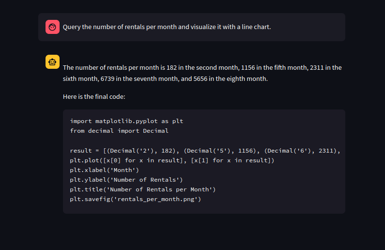

# SQL_langchain_agent
## Description 
This __LangChain SQL Agent__ enables __intuitive interaction__ with SQL databases by __translating__ natural language queries into SQL statements, simplifying __data retrieval__ and __processing__ for users without SQL expertise.

## Key Features 
This agent Utilize the __Llama3-8B__ LLM model as its __reasoning engine__ and as __language generator__, enhancing the agent's ability to __understand__ and __process__ complex natural language queries.

it also comes __pre-loaded__ with three powerful tools:
1. **SQLDatabaseToolkit:** Facilitates seamless query translation and efficient data retrieval from SQL databases.

2. **PythonREPLTool:** Enables running Python code in a separate thread it is used to process data, allowing for advanced data manipulation and analysis.

3. **FileManagementToolkit:** Allow Performing various file operations such as reading, writing, deleting, moving, and listing files.


## Database
The database used in this example is the __PostgreSQL Pagila database__, a sample __DVD rental__ database that is ideal for experimentation. To set it up using Docker, run the following command:
```bash
sh run-pg-pagila-docker.sh pagila_postgresql_docker
```
This script performs several actions : 
1. **Builds the Docker container:** Initializes the environment for running PostgreSQL.
2. **Downloads the Pagila database:** Retrieves the necessary data and schema files.
3. **Instantiates the cluster:** pre-configuration of the database.

Once the setup is finished connect to the Pagila database using the following command:
```bash
psql -U postgres -d pagila
```
Create a new __user__ role and grant him __group permission__ :
```bash
CREATE ROLE new_user WITH LOGIN PASSWORD 'password';
GRANT pagila_dba TO new_user;
```
## Run the agent

First, claim your API key from https://console.groq.com/keys and store it in the ```.env``` file.

Run the Streamlit Application: 
```bash
streamlit run main.py
```

Then enter the created account credentials to log in to the database .

Once logged in, you can start querying.
## Results
**The SQL Agent can :**

1. **Answer Database-Related Questions** 
    
2. **Process, Create and Save Plots**

3. **Return code && SQL Statements**

4. **Save output as text**

5. **etc.**

__NB:__  To modify behavior or customize responses, visit the ```template.py``` file."

These are some query responses showcasing prominent results with such technology in the future :
<div style="display: flex; flex-direction: row; align-items: center;">
    
      

</div>
<div style="display: flex; flex-direction: row; align-items: center;">

  

</div>
<div style="display: flex; flex-direction: row; align-items: center;">
    
      

</div>
<div style="display: flex; flex-direction: row; align-items: center;">

  

</div>

<div style="display: flex; flex-direction: row; align-items: center;">
    
      

</div>
<div style="display: flex; flex-direction: row; align-items: center;">

  

</div>


